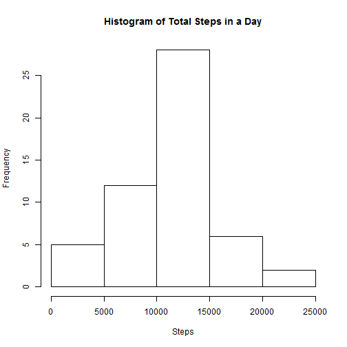
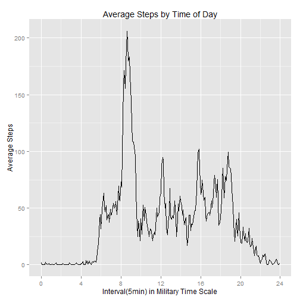
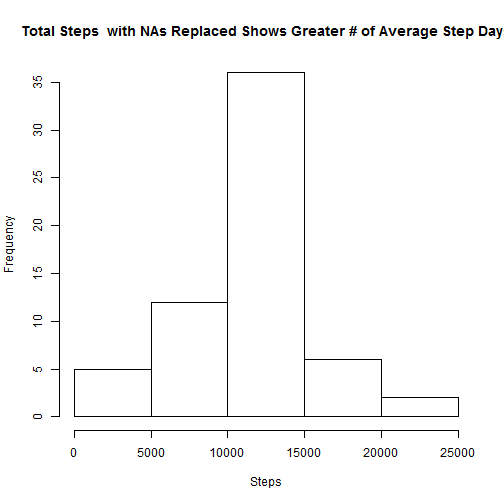
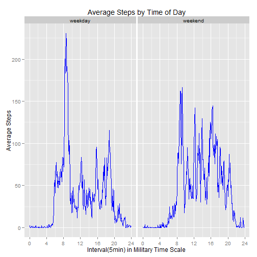

First I am loading the necessary libraries:

```r
library(ggplot2)
library(dplyr)
```


## Loading and preprocessing the data

1. Load the data (i.e. `read.csv()`)
Here's where I load the data file and change the "date" column to a Date variable type as well as remove all NAs in the steps variable.


```r
# read in the data file
activityfull <- read.csv("activity.csv", stringsAsFactors = FALSE)
```

2. Process/transform the data (if necessary) into a format suitable for your analysis

```r
# remove rows with NA values in "steps"" variable
activity <- activityfull[!is.na(activityfull$steps),]
```

## What is mean total number of steps taken per day?

1. Make a histogram of the total number of steps taken each day

```r
        # group steps by day and then sum
        totalsteps <- activity %>%
                group_by(date) %>%
                summarise(total=sum(steps,na.rm = TRUE))
        
        
        # plot a histogram of the total daily steps
        totalplot <- hist(totalsteps$total,xlab="Steps", main="Histogram of Total Steps in a Day")
```

 

2. Calculate and report the **mean** and **median** total number of steps taken per day


```r
# calculating the mean and median
        meansteps <- mean(totalsteps$total)
        
        medsteps <- median(totalsteps$total)
```

- The **mean** is: 1.0766189 &times; 10<sup>4</sup> and the **median** is: 10765


## What is the average daily activity pattern?

This time, instead of grouping by date, I'll group by the 5 minute interval and then take the average for each interval.  This will give me an understanding of how many steps the user took, on average, during a typical 24 hour period.

1. Make a time series plot (i.e. `type = "l"`) of the 5-minute interval (x-axis) and the average number of steps taken, averaged across all days (y-axis)


```r
        # calculate the average steps
        avgsteps <- activity %>%
                group_by(interval) %>%
                summarise(avg=mean(steps,na.rm = TRUE))

        avgplot <- avgsteps
        
        # convert "interval" variable to military time so the plot is cleaner
                # pad the interval variable with leading zeroes so it has uniform length
                padded <- formatC(avgplot$interval, width = 4, format = "d", flag = "0")
                
                # break apart the interval character
                hour <- as.numeric(substring(padded,1,2))
                minutefraction <- as.numeric(substring(padded,3,4))/60
                avgplot$interval <- hour + minutefraction
```

Plot using ggplot:


```r
        avplot <- ggplot(avgplot, aes(x=interval,y=avg))
        avtime <- avplot + geom_line(color="black") + labs(x="Interval(5min) in Military Time Scale",y="Average Steps", title="Average Steps by Time of Day") + scale_x_continuous(breaks = seq(0, 24, 4))
        print(avtime)
```

 

2. Which 5-minute interval, on average across all the days in the dataset, contains the maximum number of steps?

  
- The interval containing the max number of steps starts at **8:35**


## Imputing missing values

1. Calculate and report the total number of missing values in the dataset (i.e. the total number of rows with `NA`s)


```r
        missing = nrow(activityfull) - nrow(activity)
```

   - There are **2304** missing values. 

2. Devise a strategy for filling in all of the missing values in the dataset. The strategy does not need to be sophisticated. For example, you could use the mean/median for that day, or the mean for that 5-minute interval, etc.
        
        **My Strategy**:
        Use the previously calculated mean of steps for that interval as a substitute for NA.


3. Create a new dataset that is equal to the original dataset but with the missing data filled in.
        

```r
        # loop through the data set
       for(n in 1:nrow(activityfull))
       {
               # if interval in row is NA, substitute with corresponding interval from avgsteps 
                if(is.na(activityfull[n,]$steps))
                {
                        activityfull[n,]$steps <- avgsteps[avgsteps$interval==activityfull[n,]$interval,]$avg                        
                }
       }
```

4. Make a histogram of the total number of steps taken each day and Calculate and report the **mean** and **median** total number of steps taken per day. Do these values differ from the estimates from the first part of the assignment? What is the impact of imputing missing data on the estimates of the total daily number of steps?


```r
        # group steps by day and then sum
        completesteps <- activityfull %>%
                group_by(date) %>%
                summarise(complete=sum(steps,na.rm = TRUE))        
        # plot a histogram of the total daily steps
        completeplot <- hist(completesteps$complete,xlab="Steps", main="Total Steps  with NAs Replaced Shows Greater # of Average Step Days")
```

 


```r
# calculating the mean and median
        meancomplete <- mean(completesteps$complete)
        
        medcomplete <- median(completesteps$complete)
```

The **mean** is: 1.0766189 &times; 10<sup>4</sup> and the **median** is: 1.0766189 &times; 10<sup>4</sup>.  Compared to the previous values 1.0766189 &times; 10<sup>4</sup> and 10765, there is no change in values - as would be expected from using the average value as a replacement and then computing the average again.


## Are there differences in activity patterns between weekdays and weekends?

1. Create a new factor variable in the dataset with two levels -- "weekday" and "weekend" indicating whether a given date is a weekday or weekend day.


```r
        # add a factor variable to the data set and populate with day type
        activityfull$daytype <- factor(weekdays(as.Date(activityfull$date)), levels= c("Monday","Tuesday","Wednesday", "Thursday","Friday","Saturday","Sunday"))
        levels(activityfull$daytype) <- c("weekday","weekday","weekday","weekday","weekday","weekend","weekend")                
```
    
       
2. Make a panel plot containing a time series plot (i.e. `type = "l"`) of the 5-minute interval (x-axis) and the average number of steps taken, averaged across all weekday days or weekend days (y-axis). The plot should look something like the following, which was created using **simulated data**:


```r
        # summarize by daytype and interval
        daytotal <- activityfull %>%
                #filter(daytype="weekday")%>%
                group_by(daytype,interval) %>%
                summarise(intavg=mean(steps))

        # convert "interval" variable to military time so the plot is cleaner
                # pad the interval variable with leading zeroes so it has uniform length
                padded <- formatC(daytotal$interval, width = 4, format = "d", flag = "0")
                
                # break apart the interval character and recombine to military time plus fraction
                hour <- as.numeric(substring(padded,1,2))
                minutefraction <- as.numeric(substring(padded,3,4))/60
                daytotal$interval <- hour + minutefraction
        
        # make a 2 panel plot for steps
        dayplot <- ggplot(daytotal, aes(x=interval,y=intavg)) + geom_line(color="blue") + labs(x="Interval(5min) in Military Time Scale",y="Average Steps", title="Average Steps by Time of Day") + scale_x_continuous(breaks = seq(0, 24, 4)) + facet_wrap(~daytype, ncol=2)
        print(dayplot)
```

 

As you can see from the 2 plots of weekday and weekend, weekdays show spikes in activity at predictable times, while weekends have a more average amount of activity less activity during the morning and steady activity during the day and ending later than on weekdays. The spike for the weekdays corresponds to the morning work commute, lunch, rush hour home on the hours of 5, 6, and 7.
